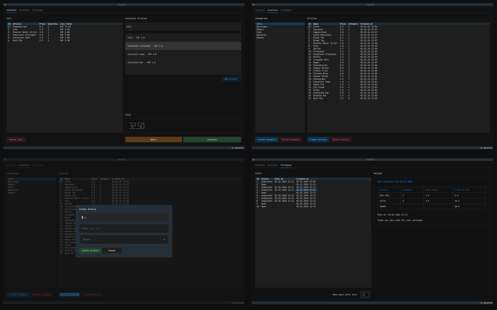

# Cashier — Terminal-Based POS System

A terminal-based Point of Sale (POS) system built with Textual. This project was created as a learning project for [Boot.dev - First Personal Project](https://www.boot.dev/lessons/d4dc954b-06cf-4f7b-bc36-fa9936c245ec).



### Features

##### Checkout

- Search articles with debounce
- Add / remove items from cart
- Live total calculation
- Abort or complete checkout
- Receipt generation

##### Article Management

- Create & delete categories
- Create & delete articles
- Filter articles by category
- Safe deletion handling

##### Purchases

- View all carts
- Filter paid carts
- View receipts

##### Architecture

- Repository layer
- Service layer
- UI layer (Textual)
- SQLite backend
- Repository and Service layer are unit-tested

### Installation & Running

##### Requirements

- Python 3.14+
- [uv](https://docs.astral.sh/uv/) (recommended)

##### Installation

```sh
# clone the repository
git clone https://github.com/kuebli/cashier
cd cashier

# create a virtual environment and activate it
uv venv
source .venv/bin/activate

# install dependencies
uv sync

# run the application
uv run main.py

# the data layer and services are unit-tested
# add execution rights to test script
# run testsuite
chmod +x ./test.sh
./test.sh
```

### Architecual Design

##### Data Layer

Responsible for all database operations.

- SQLite-based
- CRUD-only
- No business logic

Examples:

- ArticleRepo
- CartRepo
- CategoryRepo

##### Service Layer

Contains all business logic.

- InventoryService
- CheckoutService
- CartService

##### Presentation LayerHandles

TUI based on Texutal. Responsible for:

- User interaction
- Rendering
- Event handling
- Async UI updates

Includes:

- Inventory screen
- Checkout screen
- Purchases screen
- Modal dialogs

##### Data Flow

```
UI (Textual)
   ↓
Service Layer
   ↓
Repository Layer
   ↓
SQLite
```

##### Folder Structure

```
app/
│
├── db/
│   ├── db.py
│   └── repos/
│       ├── article_repo.py
│       ├── cart_repo.py
│       ├── cart_item_repo.py
│       └── ...
│
├── models/
│   ├── article.py
│   ├── cart.py
│   ├── cart_item.py
│   ├── category.py
│   └── ...
│
├── services/
│   ├── inventory_service.py
│   ├── checkout_service.py
│   └── ...
│
├── ui/
│   ├── cashier_app.py
│   ├── screens/
│   ├── widgets/
│   └── styles/
│
├── factories/
│   ├── receipt_builder.py
│   └── ...

└── main.py
```

### Future Ideas

Since this is only a learning project with a limited time budget, some features needed to use the app in the real world are still missing—for example:

- Product stock tracking
- Discounts / promotions
- Barcode scanning
- PDF receipts
- User roles
- Multi-terminal support
